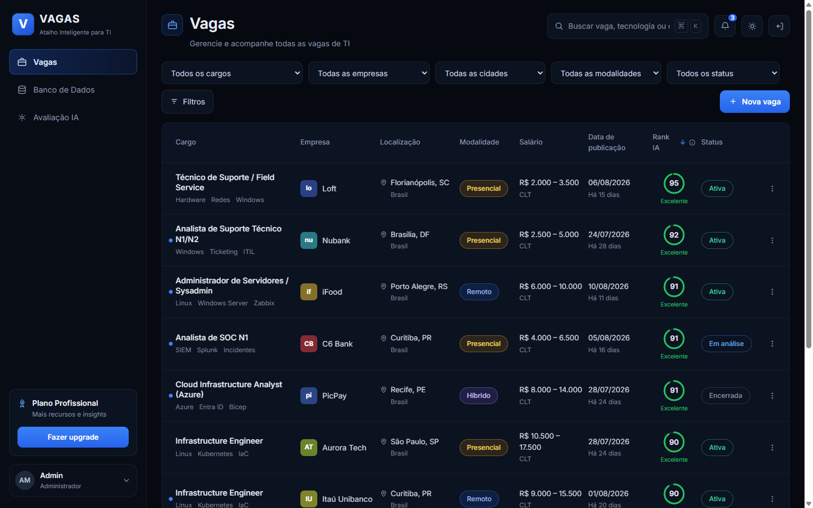

# VAGAS — Atalho Inteligente para TI

Protótipo de frontend de um buscador de vagas de TI. Serve para mostrar a
ideia: escolher cargo e cidade, buscar, e ver o resultado com ordenação,
ranking de compatibilidade ("Rank IA") e a tela de configuração da avaliação.

**Site:** https://danielcampetti.github.io/vagasatalhointeligenteparati/



## ⚠️ Onde a busca funciona, e onde não

A chave da API não pode ir para o navegador. Uma chave dentro do bundle é
pública: qualquer um abre o DevTools e queima as suas 200 requisições. Por isso
ela nunca é `VITE_*` — fica onde só o servidor enxerga, e o navegador chama
`/api/jsearch/...` na própria origem, sem saber de chave nenhuma.

Quem põe o header `x-api-key` depende de onde o app está rodando, e são três
casos diferentes:

| Onde | Quem guarda a chave | Busca e Avaliação IA |
|---|---|---|
| `npm run dev` | o proxy do Vite (`vite.config.js`) | funcionam |
| **Railway** | o `server.js` | **funcionam** |
| GitHub Pages | ninguém — é estático | `/api/jsearch` dá 404 |

O `server.js` é o endpoint que este README passou muito tempo dizendo que
faltava. Ele serve o `dist/` e reproxia os dois prefixos com as chaves vindas
das variáveis de ambiente do Railway, espelhando o que o dev server faz —
mesmos prefixos, mesma reescrita, mesmos headers de "sem chave". O app publicado
se comporta como o local de propósito: divergir criaria defeito que só aparece
em produção.

O GitHub Pages continua no ar e continua sem busca. É a vitrine estática; o
Railway é a versão que funciona.

### O app publicado não tem autenticação

Decisão consciente de quem publicou, registrada aqui para não virar surpresa:
**quem abrir a URL do Railway usa as chaves do servidor.** Isso significa as 200
requisições/mês da JSearch e os créditos Anthropic da Avaliação IA, que custam
dinheiro de verdade (ver "Quanto uma avaliação custa"). O repositório é público,
então o link é fácil de achar.

Se um dia isso incomodar, o lugar de resolver é o `server.js`: um `if` no topo
de `reproxiar` conferindo um segredo do ambiente já barra o uso alheio sem
tocar em mais nada.

O que continua sendo frio:

- O upload de currículo só lê o nome e o tamanho do arquivo no navegador. O
  arquivo não sai da máquina nem é enviado para lugar nenhum.
- O **Rank IA** não é calculado: a comparação currículo × descrição é a etapa da
  Claude, ainda não construída. A coluna mostra "—".
- A lista de 5.571 cidades do IBGE é embutida no bundle, não buscada em runtime.
- Favoritar e arquivar valem só para a sessão: recarregar volta ao estado
  inicial. **A exceção é a aba Controle** — a contagem da cota mensal mora no
  servidor agora, e é da conta: compartilhada por quem quer que abra o app,
  publicado ou em `npm run dev`. Só o cache das buscas continua no
  `localStorage`, esse sim vivendo só na máquina de quem abriu (ver "A aba
  Controle e a cota da API", abaixo).

## Configurando a chave

```bash
cp .env.example .env     # depois cole sua chave da OpenWeb Ninja no arquivo
npm run dev
```

A variável é `JSEARCH_API_KEY`, **sem** o prefixo `VITE_`. Isso é deliberado: o
Vite só injeta no bundle as variáveis que começam com `VITE_`. Renomeá-la para
`VITE_JSEARCH_API_KEY` publicaria a chave em `dist/assets/*.js`.

O `.env` está no `.gitignore`. Sem chave configurada, a busca não chega a sair
da máquina — um middleware corta antes do proxy e a tela diz o que fazer. Isso
também garante que uma chave faltando **não consome cota**.

## O que dá para fazer na tela

> **As vagas vêm da API.** `BANCO_DE_VAGAS` começa vazio e é preenchido pelo
> resultado da busca — não há mais dado fictício no repositório. As 58 vagas de
> mock foram removidas de propósito: com elas dentro, não dava para saber se a
> integração estava funcionando ou se era o mock respondendo.
>
> A tabela mostra "—" no que a API não preenche — salário, sobretudo, vem vazio
> com frequência, e o Rank IA depende da etapa da Claude. Isso é fiel ao dado,
> não falha de mapeamento — veja "O que a JSearch dá e o que falta".

- **Vagas** — o buscador. Não há filtro sobre o resultado: a tela toda são dois
  campos e um botão. Abre num estado de espera, sem resultado nenhum. **Cargo**
  (texto livre) e **cidade** (digita e escolhe da lista) ficam no bloco de
  destaque, atrás do botão **Buscar** — digitar não move a tabela, só o clique
  aplica (veja abaixo). Com resultado vêm a contagem, a ordenação por salário,
  data e Rank IA, a paginação e o menu por linha (favoritar, arquivar). Clicar
  no título abre a **página da vaga**, com a descrição completa e o link para o
  anúncio original.
- **Vaga Inteligente** — a busca que o aluno não precisa saber formular: ele
  informa só a cidade, e a IA deduz o cargo do currículo. Veja abaixo.
- **Banco de Dados** — o acervo. Lista o banco inteiro de uma vez, sem controle
  nenhum acima da tabela: só a ordenação pelo cabeçalho e a paginação.
- **Avaliação IA** — o currículo e o texto que orientaria a nota de 0 a 100. É a
  configuração do que a Vaga Inteligente executa; o currículo enviado aqui vale
  para as duas abas.
- **Controle** — quanto da cota mensal da API já foi gasto. Veja abaixo.
- Abaixo de 1024px de largura a tabela vira uma lista de cards.

Arquivar uma vaga vale para as duas abas: é o mesmo banco.

## O seletor de cidade

O seletor cobre **as 5.571 cidades do Brasil**, do IBGE — e o que você escolhe
aqui vai literalmente na consulta enviada à API, como texto.

### Como se escolhe

É um **combobox**: você digita, a lista se estreita, e escolhe uma linha. O
`CampoCidade` no `App.jsx` faz isso à mão — o projeto não tem biblioteca de UI.

Ao contrário do cargo, aqui o texto **filtra mas não vira valor**: só se pode
escolher dentro da lista, e o que ficou digitado sem escolha é descartado ao
sair do campo. É a diferença que importa entre os dois campos — cargo errado
devolve resultado ruim, cidade errada não devolve nada.

Antes o campo era um par de seletores em cascata (estado, depois cidade) —
rolar 497 opções para achar Caxias era ruim, e o `<select>` nativo só salta
pela primeira letra, então `cax` não levava a lugar nenhum.

Três detalhes que não são enfeite:

- **Acento é normalizado dos dois lados.** Sem isso, `sao` casa com **zero**
  cidades — são todas "São", com til. Seria o primeiro caso que qualquer um
  testaria.
- **Casamento exato vem primeiro.** `sao paulo` tem de pôr a capital no topo;
  na ordem alfabética pura, "São Paulo das Missões" vem antes. Depois vêm os
  que começam com o termo, depois os que o contêm em qualquer posição — é o
  que faz `sul` achar "Caxias do Sul".
- **A lista tem teto de 40 linhas**, com um rodapé dizendo quantas ficaram de
  fora. `santa` casa com 199 cidades; despejar todas seria inútil e pesado.

O valor guardado é a string completa `"Caxias do Sul, RS"`, no mesmo formato do
campo `cidade` de uma vaga — então dá para comparar direto com os dados, e é
também a forma que entra na query da API (a JSearch recebe localização como
texto, não código IBGE). A sigla faz parte do rótulo porque **232 nomes de
município se repetem entre estados** — "Bom Jesus" existe em cinco.

A lista é gerada, não escrita à mão:

```bash
npm run cidades     # baixa do IBGE e reescreve src/data/cidades.js
```

O arquivo gerado é commitado de propósito: município quase não muda, e embutir
a lista mantém a promessa de não fazer requisição nenhuma em runtime. O custo é
**+33 KB no bundle depois do gzip** (de 71,5 para 105 KB) — a resposta crua do
IBGE tem 2,4 MB, mas 97% dela é hierarquia de meso/microrregião que a tela não
usa.

## A aba Vaga Inteligente

Na aba Vagas quem sabe formular a busca é o usuário: ele escreve o cargo. A
Vaga Inteligente inverte isso — **o aluno informa só a cidade**, e o resto sai
do currículo.

O mecanismo previsto, quando as três integrações existirem:

1. a **Claude API** lê o currículo e deduz o cargo
2. a **JSearch** busca por *(cargo deduzido + cidade)*
3. a **Claude API** compara cada vaga com o currículo e dá uma nota
4. a lista volta **ordenada por compatibilidade**

O cargo deduzido não é editável: a proposta é o aluno não precisar saber o nome
do cargo que procura. Se a leitura do currículo errar, o caminho é trocar o
currículo — e esse é o ponto a revisitar se na prática a dedução falhar muito.

### O que existe hoje

Nada disso está ligado. O painel é a casca: os estados, a ordem das etapas e o
lugar de cada resultado. Concretamente:

- **Sem currículo**, a aba não tem o que fazer e manda o aluno para a Avaliação
  IA. O currículo é **um só no app inteiro** — as duas abas leem o mesmo. Trocar
  de aba não apaga a cidade já escolhida aqui, justamente porque o fluxo obriga
  esse ida-e-volta.
- **Com currículo**, o campo de cidade é o mesmo combobox da aba Vagas, e o
  botão roda uma espera simulada antes de mostrar o estado que nomeia as três
  ligações que faltam.
- **A busca é registrada na cota**, com o termo `Vaga Inteligente` no lugar do
  cargo — que só existirá quando a Claude ler o currículo. O cache vale aqui
  também: repetir a mesma cidade não consome requisição.

### Ela é a parte cara do app

Uma busca inteligente custa **1 requisição JSearch + 1 chamada Claude para o
cargo + 1 chamada Claude por vaga comparada**. Com 20 vagas no resultado, são 21
chamadas à Claude numa única busca.

A aba Controle conta só a parte da JSearch — é a cota escassa, 200 por mês. O
consumo de tokens da Claude é outro orçamento e ainda não tem medidor; se a
Vaga Inteligente virar o caminho principal, vale medir também.

## O que a JSearch dá e o que falta

A API é a **OpenWeb Ninja** (`api.openwebninja.com/jsearch/search-v2`), com os
parâmetros fixos `country=br`, `language=pt`, `num_pages=1`. A consulta é montada
como `"<cargo> em <cidade>"`, e a janela de publicação vai em `date_posted`
(veja "A janela de publicação", abaixo).

O mapeamento está em `src/api/mapear.js`, e a regra ali é **não inventar**:
campo ausente vira `null` e a tela mostra "—". Preencher com um valor plausível
faria a tabela mentir sobre o que a busca trouxe.

| Coluna | De onde vem |
|---|---|
| Cargo, Empresa | `job_title`, `employer_name` |
| Localização | `job_city` + `job_state`, com fallback para `job_location` e "Remoto" |
| Publicada | cadeia de três: `job_posted_at_timestamp`, `job_posted_at_datetime_utc`, e por último o texto `job_posted_at` ("há 7 dias"). **Na prática só o terceiro chega**: numa resposta real de 10 vagas os dois primeiros vieram `null` nas dez, e o texto veio em cinco. As outras cinco ficam com data desconhecida — e é sobre elas que a janela de publicação age |
| Salário | `job_min_salary`/`job_max_salary` — **frequentemente vazios**. Valor anual é descartado em vez de virar "R$ 60 mil por mês" |
| Modalidade | `work_arrangement` (`remote` / `onsite` / `hybrid`) → Remoto, Presencial, Híbrido |
| **Ver Vaga** | `job_apply_link`, com `apply_options[0].apply_link` de reserva — e uma peneira que só deixa passar `http`/`https` (`linkDeCandidatura`) |
| **Rank IA** | **não existe** — é a comparação currículo × descrição, a etapa da Claude |
| ~~Status~~ | **saiu da listagem.** A API não tem o campo, então `mapear.js` fixava "Ativa" em toda vaga e a coluna inteira mostrava a mesma pílula verde. O campo continua na vaga e na página de detalhe; o lugar dele na tabela virou o "Ver Vaga" |

A `job_description` inteira é guardada em cada vaga. Ela não aparece na tabela:
está lá para a comparação com o currículo.

**O título da vaga abre a página de detalhe**, dentro do app. Ela mostra o que
sabemos da vaga — incluindo a descrição completa, que não cabe na tabela — e só
no fim oferece o link para o anúncio original.

Essa ordem é deliberada: o título já foi link externo direto, e expulsava o
usuário para outro site na primeira interação com um resultado. O link para fora
existe, mas depois.

O botão externo vai com `rel="noopener noreferrer"`, que não é enfeite: sem
`noopener` a página aberta recebe uma referência a esta pela `window.opener` e
pode trocar o endereço daqui. São links de terceiros, vindos de uma API.

### A página de detalhe e o histórico

O app não tem router — as abas são estado local, e não valia trazer um só para
isso. A página de detalhe substitui a tabela quando há vaga aberta.

**O botão voltar do navegador funciona**: abrir empurra uma entrada no histórico
com `pushState`, mas **sem trocar a URL**. Uma URL nova seria pior — no GitHub
Pages não há servidor para reescrever rotas, então recarregar em `/vaga/123`
daria 404.

O preço: a vaga **não é compartilhável por link** e não sobrevive a um F5. Se
deep-link virar requisito, aí sim entra um router — e junto o `404.html` que o
GitHub Pages exige para SPAs.

> **Ao mexer no mapeamento, confira os nomes na documentação.** Dois campos
> foram deduzidos numa primeira versão e pareciam óbvios: `job_is_remote` (que
> não existe) e `job_posted_at_datetime_utc` sozinho. O resultado foram duas
> colunas inteiras vazias em toda busca. O `mapearVagas` agora imprime no
> console os campos da primeira vaga de cada resposta — custa zero requisição e
> mostra a forma real.

### A janela de publicação

O dropdown ao lado da cidade — Hoje / Últimos 3 dias / Última semana / Último
mês / Qualquer data. O padrão é **Último mês**, e essa escolha corrigiu dois
defeitos reclamados: vaga já encerrada e vaga publicada há muito tempo.

O diagnóstico saiu de sete requisições reais em 2026-09-02, mesma consulta
("Técnico de TI em Caxias do Sul, RS"), variando só o `date_posted`:

| `date_posted` | vagas | idades | sem data |
|---|---|---|---|
| *(não enviado)* | 10 | 9, 20, 21, 22, 26 dias | **5** |
| `all` | 10 | idem | **5** |
| `today` | 0 | — | — |
| `3days` | 0 | — | — |
| `week` | 10 | 9, 21, 22, 26 dias | **5** |
| `month` | 10 | 9 a 27 dias | **0** |

Duas coisas a saber antes de mexer aqui:

**A API não tem campo de expiração.** A união dos campos das 10 vagas dá 35
nomes e nenhum é de validade — não dá para perguntar se o anúncio caiu. O que
existe é a correlação: as vagas sem `job_posted_at` vinham de agregadores que
copiam anúncio e nunca o tiram do ar, e `date_posted=month` devolveu zero
delas. Por isso **idade desconhecida é descartada** em qualquer janela que não
seja "Qualquer data". Era o `all` — que é o que a API assume quando ninguém
manda `date_posted` — que deixava os zumbis entrarem.

**`week` não é honrado.** Repare na tabela: a janela mais estreita deixou
passar mais coisa velha que a mais larga. Por isso o corte acontece duas vezes
— `date_posted` na requisição e de novo na tela (`src/janela.js`). Sem o
segundo, "Última semana" seria uma promessa que a API não cumpre.

**Estreitar não gasta cota.** "Última semana" é subconjunto do que "Último mês"
já baixou, então apertar o dropdown filtra em memória — sem rede e sem
reavaliar com a Claude. Alargar precisa de requisição, porque o que ficou de
fora nunca foi baixado. Quem decide é o `cabeNoQueJaTemos`, e a distinção entre
"o recorte que a tela mostra" e "o recorte que a API atendeu" é o par
`janela` / `janelaBaixada` no `App.jsx` — é `janelaBaixada` que o "Carregar
mais" repete, porque o cursor pertence à busca que o gerou.

A janela entra na **chave do cache** (`termo|cidade|janela`). Sem isso, trocar
para "Hoje" seria servido pelo resultado guardado de "Qualquer data" — o filtro
pareceria quebrado quando era o cache respondendo pela pergunta errada.

A aba Vaga Inteligente não tem dropdown (o cargo dela sai do currículo), mas usa
a mesma janela padrão e o mesmo corte local: sem isso ela poderia destacar como
"a melhor vaga" um anúncio sem data — e, medido, o Rank IA chegou a colocar dois
desses em 2º e 3º lugar.

O Banco de Dados **não** é recortado por data: ele é acervo, e esconder o
histórico por "última semana" apagaria o que ele existe para guardar.

### Quanto uma avaliação custa, e por quê

Uma busca dispara **uma** chamada à Claude para o lote inteiro (`TAMANHO_LOTE`
é 30; a JSearch devolve ~10). A anatomia dessa chamada, medida com
`count_tokens`:

| camada | tokens | |
|---|---|---|
| esqueleto + schema | 480 | 3,9% |
| system (a instrução de avaliação) | 566 | 4,6% |
| perfil do candidato | 420 | 3,4% |
| metadados das 10 vagas | 1.342 | 10,9% |
| **descrições das 10 vagas** | **9.505** | **77,2%** |
| **total de entrada** | **12.313** | |

A saída são ~250 tokens de JSON útil. O resto é pensamento — a API confirma o
número em `usage.output_tokens_details.thinking_tokens`.

A `$2/MTok` de entrada e `$10/MTok` de saída (`claude-sonnet-5`), isso dá
**~$0,029 por busca** em `effort: medium`, contra ~$0,049 no `high` que era o
padrão implícito. Cerca de 170 buscas até o teto de US$ 5.

Duas coisas ficam claras na tabela e valem como próximos cortes:

- **77% da entrada é descrição de vaga**, e boa parte dela é texto que a
  própria `INSTRUCAO_PADRAO` manda ignorar ("Desconsidere prestígio da
  empresa, nome de mercado e texto promocional"). Uma descrição medida tinha
  6.561 caracteres terminando em política de uniforme, escala de turno e pausa
  para o cafezinho. Cortar em 1.500 caracteres tiraria **40% da entrada** —
  mas ainda **não foi medido contra a qualidade da nota**, então não foi feito.
- `JSON.stringify(x, null, 2)` gasta **356 tokens só em indentação**.

### "Ver Vaga": o anúncio a um clique da listagem

A coluna Status foi substituída por um link direto para o anúncio original,
na tabela e no cartão de tela estreita. O status não estava dizendo nada —
`mapear.js` fixa "Ativa" em toda vaga vinda da API, porque a JSearch não tem
campo de expiração —, então a coluna repetia a mesma pílula verde em todas as
linhas.

São dois caminhos para a mesma vaga, de propósito: **clicar na linha** abre a
página de detalhe (interna, com a descrição inteira e o Rank IA), e **clicar no
ícone** vai direto para o site do anunciante.

Três cuidados no componente `LinkDaVaga`, e nenhum é enfeite:

- `e.stopPropagation()` no clique. A linha inteira já abre o detalhe; sem isso
  um clique no ícone dispararia as duas coisas — a aba externa e a página
  interna por baixo dela.
- `rel="noopener noreferrer"`, pelo mesmo motivo do botão da página de
  detalhe: sem `noopener` a página aberta recebe uma referência a esta pela
  `window.opener` e pode trocar o endereço daqui.
- A URL chega **já saneada** de `mapear.js`. Enquanto o link só existia no
  detalhe, atrás de um clique deliberado, o risco era teórico; dez âncoras por
  tela montadas com URLs de terceiros que ninguém leu é outro cálculo, e um
  `javascript:` num `href` executa ao clique. A peneira mora na origem, não na
  tela: assim o valor perigoso nunca existe no estado, e nenhuma tela futura
  precisa lembrar de conferir.

Vaga sem link vira "—", como todo campo ausente da tabela. Um ícone morto
prometeria uma ação que não acontece.

### Buscar dá uma página; o botão dá as seguintes

O cache guarda a lista **acumulada** sob a mesma chave da busca — necessário,
senão repetir a consulta perderia as páginas já baixadas e pagas. Durante um
tempo `buscar()` restaurava essa lista inteira, e quem tinha clicado "Carregar
mais" três vezes numa sessão anterior clicava em Buscar e recebia 27 vagas de
uma vez. Sem gastar cota, mas contra o que o botão promete — e as 27 iam para
a Claude juntas, o que fazia uma busca "de graça" custar ~US$ 0,06.

Agora a entrada de cache registra as **fronteiras das páginas** (`paginas`),
`buscar()` restaura só a primeira, e o botão serve as seguintes direto do
cache, sem tocar a rede. Só quando o cache acaba é que ele volta a gastar uma
das 200 — e o texto embaixo do botão diz qual dos dois casos é.

Vaga que volta do cache já pontuada não é reavaliada: `ranquearPendentes` manda
para a Claude só as que estão sem nota, ancoradas nas que têm.

Entradas gravadas antes de `paginas` existir são fatiadas em `PAGINA_LEGADA`
(10). Não é adivinhação do tamanho real da página original — é o que impede
uma entrada legada de 27 vagas voltar inteira.

### "Carregar mais" manda só as vagas novas

Cada clique traz uma página nova da JSearch e a acrescenta à lista. Durante um
tempo ele **reranqueava a lista inteira** a cada clique, para que todas as
notas saíssem da mesma régua. Custava caro: medido no log real, a segunda
chamada custou 41% mais que a primeira (10.086 -> 17.668 tokens de entrada), e
numa sessão de três cliques 60% do conteúdo de vaga enviado era repetição.

Pior: a justificativa se desmontava justamente onde importava. Ela valia
"enquanto a lista couber em `TAMANHO_LOTE`" (30) — mas no terceiro clique a
lista chega a 40, o `emLotes` parte em `[20, 20]`, e você paga a entrada de 40
vagas **e** recebe as escalas misturadas que o desenho existia para evitar.

Hoje só as vagas novas viajam com descrição. Para não perder a régua, as já
pontuadas vão junto como **âncora**: apenas `{cargo, nota}`, sem descrição —
~60 tokens por vaga contra ~900 de uma descrição.

A âncora não é enfeite. O viés que ela evita está medido no cabeçalho do
`ranking.js`: um lote avaliado só contra si mesmo é graduado na curva e sobe
em bloco (+6 a +10). Numa tabela ordenada por Rank IA isso põe vaga ruim da
página 2 acima de vaga boa da página 1. Verificado funcionando: numa lista
cujas notas iam de 3 a 30, a vaga nova entrou com 15 — dentro da faixa, não
acima dela.

Resultado medido num clique real: **$0,0157 contra ~$0,0399**, 61% mais
barato, e 6,3s em vez de ~15s. Página que só traz repetidas não chama a Claude
nenhuma vez.

> **O medidor da aba Controle conta só o que o app gastou.** Chamadas feitas
> fora dele — um script de teste com a mesma chave, por exemplo — aparecem na
> fatura da Anthropic e não aqui. Ao comparar os dois números, confira o
> período e a origem antes de concluir que um deles está errado.

## A aba Controle e a cota da API

O plano gratuito da JSearch dá **200 requisições por mês**, e a ideia é gastar o
mínimo. A aba Controle existe para isso não virar surpresa no fim do mês.

O número agora é real: a aba Vagas chama a API, e cada chamada entra aqui.

**O cache é o que faz as 200 renderem.** Cada busca é identificada por
`cargo|cidade`. Se a consulta já foi feita, o resultado sai do `localStorage` e
**a requisição não acontece**; senão a chamada sai e gasta uma. A aba mostra as
duas contagens — a de rede, que é da conta e vem do servidor, e a de
repetições que o cache economizou, que é deste navegador — e o histórico, que
só lista o que de fato foi à rede, mostra o status de cada resposta.

O cache guarda as vagas inteiras, com descrição — por isso tem teto de 20
consultas, descartando as mais antigas. O `localStorage` tem uns 5 MB e não vale
enchê-lo de histórico.

**Só conta o que tocou a API.** Um erro tem três destinos diferentes:

| Situação | Consome cota? |
|---|---|
| `.env` sem chave | **Não** — um middleware corta antes do proxy; nada sai da máquina |
| 401, chave inválida | **Não** — a API recusa antes de debitar |
| Upstream inalcançável | **Não** — marcado `sem-resposta`; a JSearch nunca chegou a ser perguntada |
| 429, limite atingido | **Sim** — a requisição chegou lá |
| 200 sem resultado | **Sim** — buscar e não achar custa igual |

Quem carrega essa distinção não é mais o cliente: é `consomeCota`, em
`src/servidor/contagem.js`, decidido pelo `res` que o proxy de fato mandou —
o mesmo em produção e em `npm run dev`.

Duas regras que valem conhecer:

- **Consulta vazia não registra nada.** Sem cargo e sem cidade não haveria
  requisição a fazer, e contá-la inflaria o número à toa. A tabela ainda
  aparece — o mock devolve tudo —, mas a cota não se move.
- **A renovação é manual.** O botão *Zerar contagem* existe porque a RapidAPI
  conta pela data da assinatura, não pelo dia 1º; adivinhar essa regra daria um
  número errado. Zere quando o plano virar. *Limpar cache* é independente: zerar
  a contagem preserva o cache, e limpar o cache preserva a contagem.

O cache continua em `src/cota.js`, isolado do `App.jsx` — que já tem milhares
de linhas e não precisa ser dono do `localStorage` também. A contagem em si
saiu de lá: mora no banco do servidor (`src/servidor/banco.js`), é escrita
pelo middleware `src/servidor/contagem.js`, servida por
`src/servidor/rotasCota.js` e lida pela tela por `src/cotaRemota.js`. Toda
leitura e escrita do cache é defensiva: em aba anônima, com storage bloqueado
ou com o valor corrompido, o acesso lança, e a tela não pode quebrar por
causa dele.

**A contagem em si nunca volta a zero por falha de rede — o oposto do que
valia quando ela morava no `localStorage`.** Um `GET /api/cota` que falha cai
no estado `falhou` do painel, com o motivo escrito e um botão para tentar de
novo. Zero seria a mentira "você tem as 200 inteiras" para quem já gastou 180
— e é exatamente a mentira que esta separação existe para impedir. Ver
`src/cotaRemota.js`.

## O botão Buscar

Cargo e cidade existem em dois tempos dentro do `App`:

```js
cargoRascunho, cidadeRascunho   // o que os campos do destaque mostram
cargo, cidade                   // os critérios da consulta já feita
```

Digitar altera só o rascunho — a tabela não se move, e um aviso âmbar diz que há
critérios não aplicados. Quem promove um no outro é `buscar()`, e é ela que
dispara a requisição.

Essa separação existe porque uma chamada de rede precisa de um instante definido
para acontecer, mais os estados de carregando e de erro. Recalcular a cada tecla
serve para um array em memória e não sobrevive a uma requisição por alteração.

**A ordem dentro de `buscar()` importa:**

1. valida que há ao menos cargo ou cidade — consulta vazia não vira requisição
2. **consulta o cache primeiro** — repetir uma busca não pode custar uma das 200
3. só então chama a API, e guarda o resultado no cache
4. em caso de erro, registra o uso **apenas se a requisição tocou a API**

**Não há filtro local sobre o resultado.** O `filtradas` só ordena. Comparar a
cidade de novo aqui derrubaria vagas legítimas: a JSearch escreve "Caxias Do
Sul" ou devolve municípios vizinhos, e nada disso bate com o rótulo exato do
IBGE. Quem filtrou por localização foi a API.

O que sobrou de controle na tela é a ordenação pelo cabeçalho e a paginação,
ambas locais. A ordenação trata campo ausente como "vai para o fim" — sem isso,
`null - 5` vira `NaN` e o sort embaralha a lista inteira.

## Rodando local

```bash
npm install
cp .env.example .env     # cole sua chave da OpenWeb Ninja
npm run dev
```

Abre em `http://localhost:5173/vagasatalhointeligenteparati/` (o caminho tem o
nome do repositório por causa do `base` do Vite — veja abaixo).

Outros comandos:

```bash
npm run build     # gera dist/
npm run preview   # serve o dist/ como em produção
npm run lint      # oxlint
```

## Deploy

São dois destinos, e eles servem para coisas diferentes.

### Railway — a versão que funciona

`npm start` roda o `server.js`, que serve o `dist/` e reproxia as APIs. O
Railway usa estas variáveis de ambiente:

```
JSEARCH_API_KEY     a mesma do .env
ANTHROPIC_API_KEY   a mesma do .env
BASE_PATH=/         no build
BANCO_CAMINHO       /dados/acervo.db — o acervo compartilhado
CONTROLE_SEGREDO    opcional — tranca "Zerar" e "Ajustar" na aba Controle
```

`BASE_PATH` é o que impede a página abrir sem CSS. O padrão do `vite.config.js`
é `/vagasatalhointeligenteparati/`, que é o subcaminho do GitHub Pages; no
Railway o app tem o domínio inteiro para si e precisa de `/`. Errar isso faz o
HTML pedir os assets no lugar errado e receber 404 — o mesmo defeito nos dois
destinos, em direções opostas.

`CONTROLE_SEGREDO` é a única das cinco que é **opcional**, e de propósito:
ausente — o caso do `npm run dev`, e de quem clona o repositório sem nunca ter
ouvido falar dela —, "Zerar" e "Ajustar" na aba Controle ficam abertos. É o que
evita que a variável existir no Railway obrigue quem só está rodando local a
passar a digitar senha por algo que só faz sentido lá. Definida, as duas rotas
passam a exigir o mesmo valor no header `x-controle-segredo`, e respondem 403
sem ele — são as únicas que mudam o número gravado, e mudá-lo é decisão do
dono da conta. Ler a cota (`GET /api/cota`, o que a aba Controle consulta o
tempo todo) nunca pede segredo nenhum: ler não estraga nada, e trancar a
leitura esconderia do painel a própria informação que ele existe para
mostrar.

#### O volume do acervo

O acervo compartilhado é um SQLite, e ele precisa de um **volume do Railway
montado em `/dados`**, com `BANCO_CAMINHO=/dados/acervo.db`.

O volume não é opcional. Sem ele o `BANCO_CAMINHO` cai num caminho do disco
comum do container, que é efêmero: o app sobe, funciona perfeitamente, e o
acervo morre a cada deploy — que é exatamente o defeito que ele veio corrigir,
e sem sintoma nenhum até alguém reparar que o acervo zera sozinho. O caminho
resolvido aparece no log de arranque (`[acervo] banco em ...`), com aviso
quando a variável está ausente; é a primeira coisa a conferir se as vagas
sumirem.

> **Uma réplica, e só uma.** O desenho assume um processo, uma conexão e nenhum
> `busy_timeout`. Subir o serviço para 2 réplicas sobre o mesmo volume produz
> `SQLITE_BUSY` nas escritas, sem nenhuma nova tentativa — e "aumentar as
> réplicas" é o tipo de botão que parece inofensivo. Se um dia precisar
> escalar, o acervo tem que sair do SQLite em arquivo antes.

Local, sem `BANCO_CAMINHO`, o banco é um `acervo.db` ao lado do código
(ignorado pelo git), e o `npm run dev` serve `/api/acervo` pelo próprio dev
server do vite — as mesmas rotas do `server.js`, para dev e Railway se
comportarem igual.

Para rodar o build de produção localmente antes de publicar:

```bash
BASE_PATH=/ npm run build && npm start
```

(No Git Bash do Windows, `BASE_PATH=/` vira `/Program Files/Git` pela conversão
de caminho do MSYS. Use PowerShell — `$env:BASE_PATH='/'` — ou
`MSYS_NO_PATHCONV=1`.)

### GitHub Pages — a vitrine estática

Push na branch `main` → o workflow `.github/workflows/deploy.yml` faz o build e
publica no GitHub Pages. Também dá para disparar na mão em
**Actions → Deploy no GitHub Pages → Run workflow**.

Em **Settings → Pages**, o *source* é **GitHub Actions**.

O workflow não define `BASE_PATH`, então cai no padrão `/vagasatalhointeligenteparati/`
— que precisa ser exatamente o nome do repositório. Se o repositório for
renomeado e o padrão não acompanhar, a página abre sem CSS nenhum. O
`public/.nojekyll` existe para o Pages não ignorar arquivos e pastas que
começam com `_`.

Lá a busca não funciona: não há servidor para guardar a chave.

## Estrutura

```
index.html
.env.example        # modelo do .env com a chave da API (o .env fica fora do git)
src/
  main.jsx          # bootstrap do React
  App.jsx           # a página inteira (uma tela só, sem router — abas em estado local)
  index.css         # Tailwind + tokens do tema + estilos base
  cota.js           # cache das buscas, no localStorage — a contagem foi para o servidor
  cotaRemota.js     # busca a cota no servidor; falha nunca vira zero
  janela.js         # a janela de publicação: date_posted + o corte local
  api/jsearch.js    # a chamada de rede e os erros traduzidos
  api/mapear.js     # resposta da JSearch -> a forma de vaga da tabela
  data/vagas.js     # ⬅️ os dados mockados: é aqui que se edita o conteúdo
  data/cidades.js   # os 5.571 municípios do IBGE — gerado, não editar à mão
  servidor/contagem.js      # middleware que conta a cota pelo que o proxy respondeu
  servidor/rotasCota.js     # GET /api/cota, POST /zerar e /ajustar
  servidor/pluginServidor.js # monta acervo e cota sob o npm run dev (vite)
scripts/
  gerar-cidades.mjs # regenera cidades.js a partir da API do IBGE
public/
  .nojekyll
  favicon.svg
.github/workflows/deploy.yml
```

Stack: Vite + React 19 (JavaScript, sem TypeScript) e Tailwind CSS v4. O v4
configura o tema em CSS, pelo bloco `@theme` do `src/index.css`, em vez do
antigo `tailwind.config.js`. O layout veio de um protótipo do Claude Design que
usava estilos inline, então eles foram mantidos como estão; o Tailwind cuida do
reset, dos tokens e dos estados de `hover`.

## Editando os dados

`src/data/vagas.js` exporta `BANCO_DE_VAGAS`, **hoje um array vazio** — é onde a
resposta da API vai pousar, e a base única que a aba Vagas consulta e a aba
Banco de Dados lista. Cada item tem esta forma:

```js
{
  id: 'j0',
  cargo: 'Técnico de Redes',
  techs: ['Cisco', 'Wi-Fi', 'Switch'],
  empresa: 'Marcopolo',
  cidade: 'Caxias do Sul, RS',
  modalidade: 'Remoto',      // Remoto | Híbrido | Presencial
  min: 2.7, max: 3.9,        // faixa salarial em R$ mil
  days: 12,                  // dias desde a publicação (a data é calculada a partir de hoje)
  rank: 87,                  // 0 a 100
  status: 'Ativa',           // Ativa | Em análise | Encerrada
  seen: false,               // false mostra o ponto azul de "não lida"
  fav: false,
}
```

Colar itens nesse formato dentro do array é o jeito de ver a tabela com
conteúdo antes da API. Salvou, o Vite recarrega. Nada além disso — o
`ModalNovaVaga` existe no `App.jsx`, mas nenhum botão da tela o abre.

Uma armadilha ao preencher: **a `cidade` precisa bater exatamente com o rótulo
do IBGE**, senão o registro fica inalcançável pela busca. O seletor só oferece
os 5.571 nomes oficiais e o recorte compara a string inteira, então copie o
rótulo como ele aparece — `"Caxias do Sul, RS"`.

O `vagas.js` não exporta lista de cargo nenhuma: o campo virou texto livre.
`MODALIDADES` sobrou só para o formulário de nova vaga, e a lista de cidades do
seletor vem do `cidades.js`, do IBGE — não é derivada daqui.

O campo `techs` não filtra nada; segue aparecendo abaixo do cargo, como
informação da vaga.
